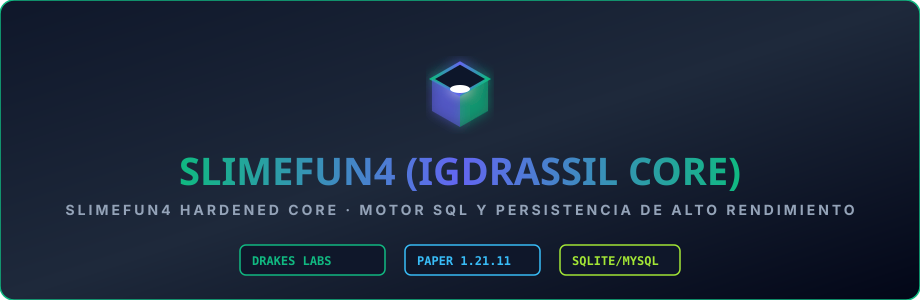

<div align="center">



# Slimefun4-Drake Core

**The Java 21 Slimefun core maintained for DrakesCraft on Paper/Purpur 1.21.11.**

</div>

> ### 🏰 ¡Únete a la Comunidad Oficial de DrakesCraft!
> 
> * 🎮 **IP del Servidor**: `play.drakescraft.cl` *(Java 1.21.11 & Bedrock)*
> * 💬 **Discord Oficial**: [discord.gg/drakescraft](https://discord.gg/rR7FbfCt9Y)
> * 🌐 **Web & Guía**: [web.drakescraft.cl](https://web.drakescraft.cl) — 🛒 **Tienda**: [web.drakescraft.cl/store](https://web.drakescraft.cl/store.html)
> 
> *¡Juega con este addon y más de 80 expansiones optimizadas en vivo en nuestra network de supervivencia técnica!*

---

## Purpose

Slimefun4-Drake owns the reliable base layer for recipes, categories, guides, research, block storage, cargo networks, energy networks and addon loading. It is the compatibility boundary for the DrakesCraft Slimefun ecosystem.

The survival guide includes native per-player bookmarks. Players can right-click
an unlocked item in a category or search result to save it, then open the star
button in the guide header for a paginated quick-access list. Bookmarks persist
as stable Slimefun item IDs in `guide-bookmarks.yml`, so addon recipe or texture
updates do not serialize stale `ItemStack` data. The feature is controlled by
`guide.bookmarks` and defaults to enabled for existing installations.

The runtime is hybrid. `Slimefun-Rust` is the shared acceleration layer for
deterministic work across this core, addons and DrakesCraft-owned plugins. Java
remains authoritative for Bukkit state and supplies a transparent fallback.

## Runtime contract

- Target: **Java 21** and **Paper/Purpur 1.21.11**.
- Artifact: `Slimefun-1.2.DEV v11.0-Drake-1.21.11-SNAPSHOT.jar`.
- Storage: the normal Slimefun storage contract remains authoritative.
- Addons: addons load through the public Slimefun API; the core does not silently rewrite their data or recipes.
- Native acceleration: ABI 1 loads `native/libslimefun_ffi.so`, accelerates
  EnergyNet aggregation and exposes a Bukkit service for compatible plugins.
  `/sf native` reports calls, fallbacks and failures.

## Controlled SFMaster path

The guide delivery path has one authority: `CheatPolicy` in this Java core.
Category pages and search results both pass through the same checks.

- Staff with the bypass remains unrestricted.
- A player with `odysseia.sfmaster.active` receives one item per claim.
- The rolling quota is persisted in the player's PDC and survives restarts.
- Every delivered item is marked with its owner before inventory insertion.
- Addons are default-deny. Only configured addons or exact item IDs are eligible,
  and equipment/endgame blocklists still apply afterward.
- `/sf give` remains a staff operation. Odysseia blocks paid pass holders from
  using it and owns guide expiry, transfer prevention, and legacy audits.

## Build and validation

```bash
mvn package -DskipTests
mvn test -DlegacyMockBukkitTests \
  -Dtest=TestColorCodes,TestSlimefunSpelling,TestDoubleRangeSetting,TestEnumSetting,TestIntRangeSetting,TestItemSettings,TestMaterialTagSetting,TestNetworkManager,TestResearches,TestUpdaterService,TestRechargeableItems
```

GitHub Actions publishes the exact production JAR from a successful Java CI run and performs a Paper 1.21.11 end-to-end boot check for pull requests. Prefer that artifact to an unverified local build.

The isolated `ClaimWindowTest` does not require MockBukkit. The legacy MockBukkit
suite currently requires registry fixtures compatible with Paper 1.21.11; a
registry bootstrap failure is infrastructure debt, not a valid SFMaster result.

## Deployment discipline

1. Back up the active Slimefun JAR and storage before a core update.
2. Keep exactly one active Slimefun core JAR in `plugins/`.
3. Do not hot-reload Slimefun or replace its JAR while Paper is running.
4. Restart during a maintenance window and verify the startup log, addon load list, BlockStorage load and no duplicate-plugin warning.
5. Smoke-test the Slimefun Guide, a machine, a CargoNet operation and an EnergyNet operation before calling the update complete.

## Guías DrakesCraft

- [Progresión y automatización](docs/GUIA_DE_PROGRESION_Y_AUTOMATIZACION.md)
- [Integridad de redes](https://github.com/DrakesCraft-Labs/NetworksV6-drake/blob/main/docs/INTEGRIDAD_DE_RED_DRAKESCRAFT.md)

## Maintainers

DrakesCraft Labs / JackStar. Upstream Slimefun licensing remains GPL-3.0.

## Support

This repository is the operational reference for the DrakesCraft core. Attach
generated error reports to the relevant DrakesCraft repository issue tracker;
do not publish them to public paste services because they can contain server
paths, plugin inventories or other operational metadata.
